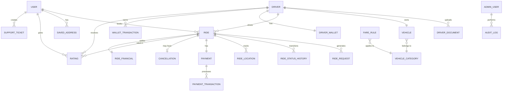
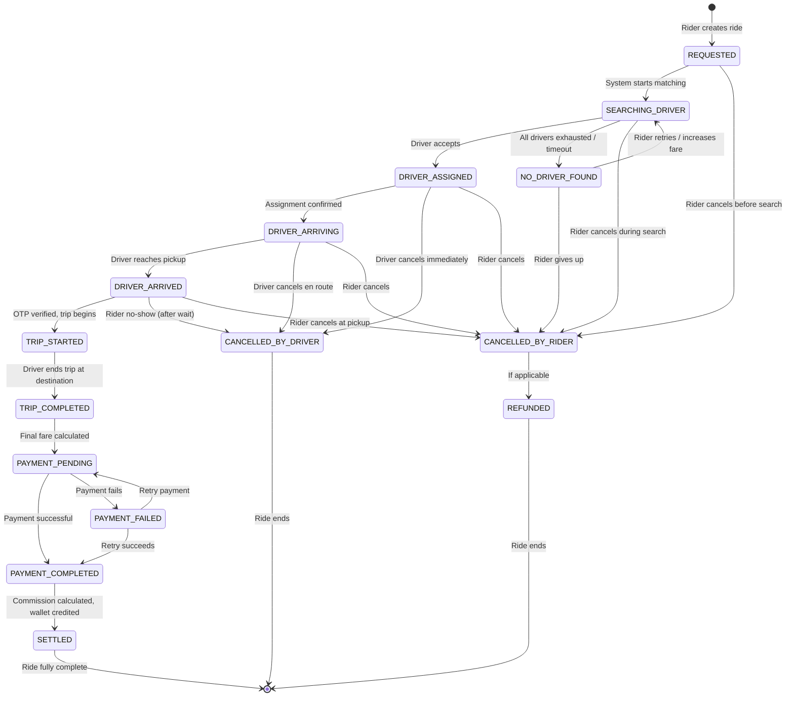

# 🚀 MASTER DEVELOPMENT PLAN — RIDE BOOKING PLATFORM ("RideNow")

> **Document Version**: 1.0  
> **Date**: August 8, 2026  
> **Status**: Awaiting Approval  
> **Author**: Senior Architecture Team

---

## Table of Contents

| Section | Title |
|---------|-------|
| 1 | [Complete System Overview](#section-1--complete-system-overview) |
| 2 | [Recommended Technology Stack](#section-2--recommended-technology-stack) |
| 3 | [High-Level Architecture Diagram](#section-3--high-level-architecture-diagram) |
| 4 | [Complete Database Architecture](#section-4--complete-database-architecture) |
| 5 | [Complete Database Tables & Relationships](#section-5--complete-database-tables--relationships) |
| 6 | [Backend Module Architecture](#section-6--complete-backend-module-architecture) |
| 7 | [Rider App Architecture](#section-7--complete-rider-app-architecture) |
| 8 | [Driver App Architecture](#section-8--complete-driver-app-architecture) |
| 9 | [Admin Panel Architecture](#section-9--complete-admin-panel-architecture) |
| 10 | [Ride Lifecycle / State Machine](#section-10--complete-ride-lifecycle--state-machine) |
| 11 | [Driver Matching Algorithm](#section-11--driver-matching-algorithm) |
| 12 | [Race-Condition & Concurrency Strategy](#section-12--race-condition--concurrency-strategy) |
| 13 | [Real-Time Communication Architecture](#section-13--real-time-communication-architecture) |
| 14 | [Push Notification / Background Driver Architecture](#section-14--push-notification--background-driver-architecture) |
| 15 | [Fare / Pricing Architecture](#section-15--fare--pricing-architecture) |

> [!NOTE]
> Sections 16–30 and Missed Edge Cases are in the companion document: [Master Plan Part 2](file:///C:/Users/arivu/.gemini/antigravity-ide/brain/cb9be255-2842-4494-af3e-2af43464dab8/implementation_plan_part2.md)  
> Database schema details: [Database Schema](file:///C:/Users/arivu/.gemini/antigravity-ide/brain/cb9be255-2842-4494-af3e-2af43464dab8/database_schema.md)  
> API design details: [API Design](file:///C:/Users/arivu/.gemini/antigravity-ide/brain/cb9be255-2842-4494-af3e-2af43464dab8/api_design.md)

---

# SECTION 1 — COMPLETE SYSTEM OVERVIEW

## 1.1 Platform Identity

**RideNow** is a multi-tenant ride-booking platform supporting both short-distance city rides and long-distance intercity travel, with immediate and scheduled booking capabilities. It consists of three distinct applications sharing a unified backend.

## 1.2 Three Applications

```
┌──────────────────────────────────────────────────────────────────────┐
│                        RIDENOW PLATFORM                             │
├───────────────────┬──────────────────────┬──────────────────────────┤
│   RIDER APP       │   DRIVER APP         │   ADMIN PANEL            │
│   (Mobile)        │   (Mobile)           │   (Web)                  │
│                   │                      │                          │
│ • Registration    │ • Registration       │ • Dashboard              │
│ • Booking         │ • Document Upload    │ • User Management        │
│ • Tracking        │ • Go Online/Offline  │ • Driver Management      │
│ • Payment         │ • Accept/Reject      │ • Ride Management        │
│ • Rating          │ • Navigation         │ • Financial Management   │
│ • History         │ • Earnings           │ • Pricing Configuration  │
│ • Support         │ • Wallet             │ • Support Tickets        │
│ • Schedule Rides  │ • Ratings            │ • Analytics              │
│                   │ • Support            │ • Audit Logs             │
└───────────────────┴──────────────────────┴──────────────────────────┘
                              │
                    ┌─────────▼──────────┐
                    │   UNIFIED BACKEND   │
                    │   (Source of Truth)  │
                    └────────────────────┘
```

## 1.3 Core Business Rules

| Rule | Description |
|------|-------------|
| **Single Assignment** | One ride → one driver. No exceptions. |
| **Backend Authority** | All fare calculations, ride status changes, and payment confirmations originate from the backend. |
| **Financial Auditability** | Every rupee movement is recorded in an immutable ledger. |
| **Configurable Pricing** | Commission %, fare rules, cancellation fees — all admin-configurable, never hardcoded. |
| **Privacy by Design** | Minimum necessary data exposure between rider and driver. |
| **Graceful Degradation** | Notification/email failures never block ride operations. |
| **Platform Safety** | OTP verification, SOS, trip sharing, route deviation alerts. |

## 1.4 Ride Types Matrix

| Dimension | Immediate Ride | Scheduled Ride |
|-----------|---------------|----------------|
| **Booking Time** | Now | Future date/time (min 30 min ahead) |
| **Driver Matching** | Real-time | Pre-match 30-45 min before pickup |
| **Distance** | Short or Long | Short or Long |
| **Pricing** | Standard | Standard + scheduling fee |
| **Cancellation** | Immediate rules | Time-based sliding scale |
| **Driver Pool** | Nearby online drivers | Eligible drivers who opt in |

## 1.5 Distance Categories

| Category | Range | Pricing Model | Driver Eligibility | Examples |
|----------|-------|---------------|-------------------|----------|
| **Short** | 0–50 km | Base + per-km + per-min | City drivers, any vehicle | Home → Office |
| **Long** | 50+ km | Long-distance rate card | Long-distance verified, specific vehicles | Chennai → Pondicherry |

## 1.6 Financial Flow

```
RIDER PAYS ₹1,000
       │
       ├──► Platform Commission (20%) = ₹200
       │         │
       │         ├──► GST on commission (18%) = ₹36
       │         └──► Net platform revenue = ₹164
       │
       └──► Driver Share (80%) = ₹800
                 │
                 ├──► TDS (if applicable) = varies
                 └──► Net driver payout = ₹800 - TDS
```

## 1.7 User Roles & Permissions

| Role | Scope |
|------|-------|
| **Rider** | Book rides, make payments, rate, view history, contact support |
| **Driver** | Accept rides, navigate, complete trips, view earnings, request payout |
| **Admin** | Full platform control: users, drivers, rides, finances, pricing, support |
| **Super Admin** | Admin + manage other admins, system configuration, audit access |

---

# SECTION 2 — RECOMMENDED TECHNOLOGY STACK

## 2.1 Technology Selection Matrix

| Layer | Technology | Version | Justification |
|-------|-----------|---------|---------------|
| **Backend Framework** | Java 21 + Spring Boot 3.3 | LTS | Type-safe, enterprise-grade, massive ecosystem, excellent concurrency support, strong ORM, battle-tested for financial systems |
| **Database (Primary)** | PostgreSQL 16 | Stable | ACID compliance, row-level locking, JSONB support, PostGIS for geospatial, excellent indexing, advisory locks for concurrency |
| **Cache / Session** | Redis 7 | Stable | In-memory speed, pub/sub for real-time, geospatial commands (GEORADIUS), distributed locks, session management |
| **Message Queue** | Redis Streams + Bull (Phase 1) → RabbitMQ (Phase 3) | — | Start simple, graduate to dedicated MQ when scale demands |
| **Real-Time** | WebSocket (Spring WebSocket + STOMP) | — | Native Spring support, bi-directional, efficient for ride tracking |
| **Push Notifications** | Firebase Cloud Messaging (FCM) | — | Cross-platform, reliable delivery, supports data + notification messages, free tier |
| **Mobile Framework** | Flutter 3.x | Stable | Single codebase for iOS + Android, excellent performance, rich UI toolkit, strong ecosystem, good for startup velocity |
| **Admin Panel** | Next.js 14 + React | LTS | Server-side rendering for dashboards, great DX, TypeScript support, easy deployment |
| **Maps & Location** | Google Maps Platform | — | Directions API, Distance Matrix, Geocoding, Places, industry standard |
| **Payment Gateway** | Razorpay | — | Indian market leader, excellent API, webhook support, auto-split, UPI/cards/wallets |
| **Email** | AWS SES or SendGrid | — | High deliverability, template support, reasonable cost |
| **SMS** | Twilio or MSG91 | — | Indian number support, OTP APIs, DLT registration |
| **File Storage** | AWS S3 / Google Cloud Storage | — | Secure document storage, pre-signed URLs, lifecycle policies |
| **Search** | PostgreSQL Full-Text (Phase 1) → Elasticsearch (Phase 3) | — | Start simple, scale when needed |
| **Monitoring** | Prometheus + Grafana (Phase 2+) | — | Open-source, powerful, industry standard |
| **Logging** | SLF4J + Logback → ELK Stack (Phase 3) | — | Structured logging, centralized when scale demands |
| **CI/CD** | GitHub Actions | — | Free for small teams, good Docker support |
| **Containerization** | Docker + Docker Compose (Phase 1) → Kubernetes (Phase 3) | — | Start simple, orchestrate later |
| **Cloud** | AWS / GCP / DigitalOcean | — | DigitalOcean for MVP (cost), AWS/GCP for production |

## 2.2 Why NOT Other Choices

| Rejected | Reason |
|----------|--------|
| **Node.js backend** | Weaker type safety for complex financial logic, callback complexity for concurrent operations, less mature ORM ecosystem for complex relational schemas |
| **MongoDB** | Ride-booking is inherently relational (users → rides → payments → settlements). Document DB adds complexity for transactions and joins. |
| **React Native** | Flutter offers better performance, more consistent cross-platform behavior, and Dart's type safety is superior for complex state management |
| **Native Android + iOS** | Double the development effort, double the team, double the bugs. Not practical for initial launch. |
| **Kafka** | Overkill for Phase 1-2. Redis Streams provides sufficient pub/sub and queue functionality. |
| **gRPC** | Adds complexity for mobile clients. REST with WebSockets is simpler and sufficient. |
| **Firebase Realtime DB** | Vendor lock-in, limited query capability, not suitable as primary database for financial data |

## 2.3 Spring Boot Module Selection

| Module | Purpose |
|--------|---------|
| `spring-boot-starter-web` | REST APIs |
| `spring-boot-starter-data-jpa` | Database ORM (Hibernate) |
| `spring-boot-starter-security` | Authentication & Authorization |
| `spring-boot-starter-websocket` | Real-time communication |
| `spring-boot-starter-validation` | Input validation |
| `spring-boot-starter-mail` | Email sending |
| `spring-boot-starter-data-redis` | Redis caching & geo |
| `spring-boot-starter-actuator` | Health checks & metrics |
| `jjwt` | JWT token management |
| `springdoc-openapi` | API documentation |
| `flyway` | Database migrations |
| `mapstruct` | DTO mapping |
| `lombok` | Boilerplate reduction |
| `jackson` | JSON serialization |

---

# SECTION 3 — HIGH-LEVEL ARCHITECTURE DIAGRAM

## 3.1 System Architecture

```
                    ┌─────────────────────────────────────────────────────────────┐
                    │                    CLIENT APPLICATIONS                       │
                    │                                                             │
                    │  ┌──────────┐    ┌──────────┐    ┌──────────────────┐      │
                    │  │ Rider App│    │Driver App│    │  Admin Panel     │      │
                    │  │ (Flutter)│    │ (Flutter)│    │  (Next.js)       │      │
                    │  └────┬─────┘    └────┬─────┘    └──────┬───────────┘      │
                    └───────┼───────────────┼─────────────────┼──────────────────┘
                            │               │                 │
                    ┌───────▼───────────────▼─────────────────▼──────────────────┐
                    │                   API GATEWAY / LOAD BALANCER               │
                    │              (Nginx / AWS ALB — Phase 2+)                  │
                    │          Rate Limiting · SSL Termination · Routing          │
                    └───────────────────────┬────────────────────────────────────┘
                                            │
                    ┌───────────────────────▼────────────────────────────────────┐
                    │              SPRING BOOT APPLICATION SERVER                 │
                    │                                                            │
                    │  ┌──────────────────────────────────────────────────────┐  │
                    │  │                  API LAYER (REST Controllers)        │  │
                    │  │  Auth │ User │ Driver │ Ride │ Payment │ Admin │ ... │  │
                    │  └──────────────────────┬───────────────────────────────┘  │
                    │                         │                                  │
                    │  ┌──────────────────────▼───────────────────────────────┐  │
                    │  │              SERVICE LAYER (Business Logic)          │  │
                    │  │                                                      │  │
                    │  │  AuthService        RideService       PaymentService │  │
                    │  │  UserService        MatchingService   WalletService  │  │
                    │  │  DriverService      PricingService    NotifService   │  │
                    │  │  VehicleService     TrackingService   SupportService │  │
                    │  │  SchedulerService   CancellationSvc   AuditService  │  │
                    │  └──────────────────────┬───────────────────────────────┘  │
                    │                         │                                  │
                    │  ┌──────────────────────▼───────────────────────────────┐  │
                    │  │            REPOSITORY / DATA ACCESS LAYER            │  │
                    │  │         JPA Repositories · Custom Queries            │  │
                    │  └──────────────────────┬───────────────────────────────┘  │
                    │                         │                                  │
                    │  ┌──────────────────────▼───────────────────────────────┐  │
                    │  │              WEBSOCKET LAYER (STOMP)                 │  │
                    │  │    /topic/ride/{id}  ·  /topic/driver/{id}           │  │
                    │  │    /topic/tracking/{id}  ·  /queue/notifications     │  │
                    │  └─────────────────────────────────────────────────────┘  │
                    └──────┬──────────────┬──────────────┬──────────────────────┘
                           │              │              │
              ┌────────────▼──┐   ┌───────▼───────┐  ┌──▼──────────────┐
              │  PostgreSQL   │   │    Redis       │  │  File Storage   │
              │  (Primary DB) │   │  (Cache/Geo/   │  │  (S3/GCS)      │
              │               │   │   PubSub/Lock) │  │                │
              │ • Users       │   │                │  │ • Documents    │
              │ • Rides       │   │ • Driver locs  │  │ • Photos       │
              │ • Payments    │   │ • Sessions     │  │ • Licences     │
              │ • Ledger      │   │ • Geo index    │  │                │
              │ • Audit       │   │ • Rate limits  │  │                │
              └───────────────┘   │ • Job queues   │  └────────────────┘
                                  └───────┬───────┘
                                          │
                    ┌─────────────────────▼──────────────────────────────┐
                    │              EXTERNAL SERVICES                      │
                    │                                                    │
                    │  ┌──────────┐ ┌──────────┐ ┌────────┐ ┌────────┐ │
                    │  │ Razorpay │ │   FCM    │ │  SES   │ │ Google │ │
                    │  │(Payment) │ │ (Push)   │ │(Email) │ │ Maps   │ │
                    │  └──────────┘ └──────────┘ └────────┘ └────────┘ │
                    │  ┌──────────┐ ┌──────────┐                       │
                    │  │  MSG91   │ │ Sentry   │                       │
                    │  │  (SMS)   │ │(Errors)  │                       │
                    │  └──────────┘ └──────────┘                       │
                    └───────────────────────────────────────────────────┘
```

## 3.2 Data Flow Architecture

```
RIDER REQUEST ──► API Gateway ──► Auth Filter ──► Rate Limiter ──► Controller
                                                                       │
                                                                       ▼
                                                                  Service Layer
                                                                       │
                                    ┌──────────────────────────────────┤
                                    │              │                    │
                                    ▼              ▼                    ▼
                              PostgreSQL        Redis             External APIs
                            (Persistent)     (Ephemeral)         (Maps/Payment)
                                    │              │                    │
                                    └──────────────┤                    │
                                                   ▼                    │
                                            Response Builder ◄──────────┘
                                                   │
                                                   ▼
                                            API Response ──► Client
```

## 3.3 Real-Time Data Flow

```
DRIVER GPS UPDATE ──► WebSocket ──► TrackingService
                                          │
                                ┌─────────┼──────────┐
                                ▼         ▼          ▼
                          Redis GEO   PostgreSQL   WebSocket Broadcast
                         (live loc)  (ride_locs)   to Rider App
                                                       │
                                                       ▼
                                                  Rider sees
                                                  driver moving
```

---

# SECTION 4 — COMPLETE DATABASE ARCHITECTURE

## 4.1 Database Strategy

| Aspect | Decision | Rationale |
|--------|----------|-----------|
| **Engine** | PostgreSQL 16 | ACID, PostGIS, row-level locking, advisory locks, JSONB |
| **Schema** | Single schema (`ridenow`) for Phase 1 | Simplicity, easy joins |
| **Migrations** | Flyway | Version-controlled, repeatable, rollback support |
| **Naming** | `snake_case`, singular table names | PostgreSQL convention |
| **Soft Delete** | Yes for users, drivers, rides | Audit trail, data recovery |
| **Timestamps** | `created_at`, `updated_at` on ALL tables | UTC, auto-managed |
| **UUIDs** | Primary keys use UUID v7 (time-sortable) | No sequential guessing, distributed-safe |
| **Indexes** | Covered queries for all search/filter paths | Performance |
| **Partitioning** | Time-based partitioning on `ride`, `payment`, `audit_log` (Phase 3) | Scale |

## 4.2 PostGIS for Geospatial

```sql
-- Enable PostGIS extension
CREATE EXTENSION IF NOT EXISTS postgis;

-- Driver locations use GEOGRAPHY type for accurate distance calculations
-- This enables queries like:
-- "Find all drivers within 5km of this point"
SELECT * FROM driver_location 
WHERE ST_DWithin(
    location::geography, 
    ST_MakePoint(80.2707, 13.0827)::geography, 
    5000  -- 5km in meters
);
```

## 4.3 Entity Relationship Overview



## 4.4 Index Strategy

| Table | Index | Type | Purpose |
|-------|-------|------|---------|
| `user` | `idx_user_phone` | UNIQUE | Phone lookup, prevent duplicates |
| `user` | `idx_user_email` | UNIQUE (nullable) | Email lookup |
| `driver` | `idx_driver_status` | B-TREE | Filter by approval status |
| `driver` | `idx_driver_online` | B-TREE PARTIAL (`WHERE is_online = true`) | Only index online drivers for matching |
| `ride` | `idx_ride_status` | B-TREE | Filter by ride status |
| `ride` | `idx_ride_rider` | B-TREE | Rider's ride history |
| `ride` | `idx_ride_driver` | B-TREE | Driver's ride history |
| `ride` | `idx_ride_created` | B-TREE | Time-based queries |
| `ride` | `idx_ride_scheduled` | B-TREE PARTIAL (`WHERE ride_type = 'SCHEDULED'`) | Scheduled ride queries |
| `payment` | `idx_payment_ride` | UNIQUE | One payment per ride |
| `payment` | `idx_payment_gateway_id` | UNIQUE | Idempotent webhook processing |
| `ride_request` | `idx_request_ride_driver` | UNIQUE | Prevent duplicate requests to same driver |
| `driver_location` | `idx_driver_loc_geo` | GIST (PostGIS) | Geospatial nearby search |
| `wallet_transaction` | `idx_wallet_idempotency` | UNIQUE | Prevent duplicate transactions |
| `audit_log` | `idx_audit_created` | B-TREE | Time-based audit queries |

> [!IMPORTANT]
> Full table definitions with all columns, types, constraints, and relationships are in the companion document: [Database Schema](file:///C:/Users/arivu/.gemini/antigravity-ide/brain/cb9be255-2842-4494-af3e-2af43464dab8/database_schema.md)

---

# SECTION 5 — COMPLETE DATABASE TABLES & RELATIONSHIPS

## 5.1 Table Summary (30 Tables)

| # | Table | Purpose | Key Relationships |
|---|-------|---------|-------------------|
| 1 | `user` | Rider accounts | → rides, saved_addresses, ratings, support_tickets |
| 2 | `driver` | Driver accounts | → driver_documents, vehicle, rides, wallet, ratings |
| 3 | `driver_document` | Licence, ID, insurance docs | → driver |
| 4 | `driver_location` | Real-time GPS position | → driver |
| 5 | `driver_availability` | Online/offline + heartbeat | → driver |
| 6 | `vehicle` | Driver's vehicle info | → driver, vehicle_category |
| 7 | `vehicle_category` | Sedan, SUV, Auto, etc. | → vehicles, fare_rules |
| 8 | `ride` | Core ride record | → user, driver, vehicle_category, payment |
| 9 | `ride_request` | Individual driver requests | → ride, driver |
| 10 | `ride_assignment` | Locked ride-to-driver link | → ride, driver |
| 11 | `ride_status_history` | State transition audit | → ride |
| 12 | `ride_location` | GPS breadcrumbs during trip | → ride |
| 13 | `ride_financial` | Immutable financial breakdown | → ride |
| 14 | `scheduled_ride` | Future ride bookings | → ride |
| 15 | `payment` | Payment record | → ride |
| 16 | `payment_transaction` | Gateway interactions | → payment |
| 17 | `refund` | Refund records | → payment |
| 18 | `driver_wallet` | Current balance | → driver |
| 19 | `wallet_transaction` | Every credit/debit entry | → driver_wallet |
| 20 | `payout` | Withdrawal/settlement | → driver |
| 21 | `fare_rule` | Pricing configuration | → vehicle_category |
| 22 | `fare_modifier` | Surge, scheduled, extra rules | — |
| 23 | `cancellation` | Cancellation records + fees | → ride |
| 24 | `cancellation_rule` | Configurable cancellation policies | → vehicle_category |
| 25 | `rating` | Rider↔Driver ratings | → ride, user, driver |
| 26 | `notification` | All notifications log | → user/driver |
| 27 | `saved_address` | Rider's saved places | → user |
| 28 | `support_ticket` | Help/support requests | → user/driver, ride |
| 29 | `admin_user` | Admin accounts | — |
| 30 | `audit_log` | System operation log | → admin_user |

## 5.2 Critical Table Definitions (Abbreviated)

### `ride` — The Central Entity

```sql
CREATE TABLE ride (
    id                  UUID PRIMARY KEY DEFAULT gen_random_uuid(),
    ride_number         VARCHAR(20) NOT NULL UNIQUE,  -- Human-readable: RN-20260808-0001
    rider_id            UUID NOT NULL REFERENCES "user"(id),
    driver_id           UUID REFERENCES driver(id),
    vehicle_category_id UUID NOT NULL REFERENCES vehicle_category(id),
    
    -- Type & Status
    ride_type           VARCHAR(20) NOT NULL CHECK (ride_type IN ('IMMEDIATE', 'SCHEDULED')),
    distance_type       VARCHAR(20) NOT NULL CHECK (distance_type IN ('SHORT', 'LONG')),
    status              VARCHAR(30) NOT NULL DEFAULT 'REQUESTED',
    
    -- Locations (stored as lat/lng AND address text)
    pickup_lat          DECIMAL(10,7) NOT NULL,
    pickup_lng          DECIMAL(10,7) NOT NULL,
    pickup_address      TEXT NOT NULL,
    drop_lat            DECIMAL(10,7) NOT NULL,
    drop_lng            DECIMAL(10,7) NOT NULL,
    drop_address        TEXT NOT NULL,
    
    -- Route estimates (from Maps API at booking time)
    estimated_distance_km   DECIMAL(10,2) NOT NULL,
    estimated_duration_min  INTEGER NOT NULL,
    estimated_fare          DECIMAL(10,2) NOT NULL,
    
    -- Actual values (filled after trip completion)
    actual_distance_km      DECIMAL(10,2),
    actual_duration_min     INTEGER,
    
    -- Rider extra amount
    extra_amount            DECIMAL(10,2) DEFAULT 0.00,
    
    -- Final fare (calculated by backend after trip)
    final_fare              DECIMAL(10,2),
    
    -- OTP for ride verification
    ride_otp                VARCHAR(6),
    otp_verified            BOOLEAN DEFAULT FALSE,
    
    -- Timestamps
    requested_at        TIMESTAMP WITH TIME ZONE DEFAULT NOW(),
    driver_assigned_at  TIMESTAMP WITH TIME ZONE,
    driver_arrived_at   TIMESTAMP WITH TIME ZONE,
    trip_started_at     TIMESTAMP WITH TIME ZONE,
    trip_completed_at   TIMESTAMP WITH TIME ZONE,
    cancelled_at        TIMESTAMP WITH TIME ZONE,
    
    -- Idempotency
    idempotency_key     VARCHAR(64) UNIQUE,
    
    -- Soft delete
    is_deleted          BOOLEAN DEFAULT FALSE,
    created_at          TIMESTAMP WITH TIME ZONE DEFAULT NOW(),
    updated_at          TIMESTAMP WITH TIME ZONE DEFAULT NOW(),
    
    -- Constraints
    CONSTRAINT chk_ride_status CHECK (status IN (
        'REQUESTED', 'SEARCHING_DRIVER', 'DRIVER_ASSIGNED',
        'DRIVER_ARRIVING', 'DRIVER_ARRIVED', 'TRIP_STARTED',
        'TRIP_COMPLETED', 'PAYMENT_PENDING', 'PAYMENT_COMPLETED',
        'SETTLED', 'CANCELLED_BY_RIDER', 'CANCELLED_BY_DRIVER',
        'NO_DRIVER_FOUND', 'PAYMENT_FAILED', 'REFUNDED', 'EXPIRED'
    ))
);
```

### `ride_assignment` — Prevents Race Conditions

```sql
CREATE TABLE ride_assignment (
    id          UUID PRIMARY KEY DEFAULT gen_random_uuid(),
    ride_id     UUID NOT NULL UNIQUE REFERENCES ride(id),  -- UNIQUE = only ONE assignment per ride
    driver_id   UUID NOT NULL REFERENCES driver(id),
    assigned_at TIMESTAMP WITH TIME ZONE DEFAULT NOW(),
    version     INTEGER NOT NULL DEFAULT 1,  -- Optimistic locking
    
    -- This UNIQUE constraint on ride_id is the CRITICAL race-condition prevention
    -- If two drivers try to accept simultaneously, only one INSERT succeeds
    CONSTRAINT uq_ride_assignment_ride UNIQUE (ride_id)
);
```

### `ride_financial` — Immutable Financial Record

```sql
CREATE TABLE ride_financial (
    id                      UUID PRIMARY KEY DEFAULT gen_random_uuid(),
    ride_id                 UUID NOT NULL UNIQUE REFERENCES ride(id),
    
    -- Amounts
    base_fare               DECIMAL(10,2) NOT NULL,
    distance_fare           DECIMAL(10,2) NOT NULL,
    time_fare               DECIMAL(10,2) NOT NULL,
    waiting_charge          DECIMAL(10,2) DEFAULT 0.00,
    toll_charge             DECIMAL(10,2) DEFAULT 0.00,
    parking_charge          DECIMAL(10,2) DEFAULT 0.00,
    scheduled_fee           DECIMAL(10,2) DEFAULT 0.00,
    extra_amount            DECIMAL(10,2) DEFAULT 0.00,
    subtotal                DECIMAL(10,2) NOT NULL,
    
    -- Tax
    tax_percentage          DECIMAL(5,2) NOT NULL,
    tax_amount              DECIMAL(10,2) NOT NULL,
    
    -- Discount
    discount_amount         DECIMAL(10,2) DEFAULT 0.00,
    promo_code              VARCHAR(50),
    
    -- Final
    total_fare              DECIMAL(10,2) NOT NULL,
    
    -- Commission split
    commission_percentage   DECIMAL(5,2) NOT NULL,
    platform_commission     DECIMAL(10,2) NOT NULL,
    driver_earnings         DECIMAL(10,2) NOT NULL,
    
    -- GST on commission
    commission_gst_pct      DECIMAL(5,2) DEFAULT 18.00,
    commission_gst_amount   DECIMAL(10,2) DEFAULT 0.00,
    
    -- Snapshot of fare rules at time of ride (for audit)
    fare_rule_snapshot      JSONB NOT NULL,
    
    -- Immutability flag
    is_finalized            BOOLEAN DEFAULT FALSE,
    finalized_at            TIMESTAMP WITH TIME ZONE,
    
    created_at              TIMESTAMP WITH TIME ZONE DEFAULT NOW()
);
```

### `driver_wallet` + `wallet_transaction` — Double-Entry Ledger

```sql
CREATE TABLE driver_wallet (
    id              UUID PRIMARY KEY DEFAULT gen_random_uuid(),
    driver_id       UUID NOT NULL UNIQUE REFERENCES driver(id),
    balance         DECIMAL(12,2) NOT NULL DEFAULT 0.00,
    pending_amount  DECIMAL(12,2) NOT NULL DEFAULT 0.00,
    total_earned    DECIMAL(12,2) NOT NULL DEFAULT 0.00,
    total_paid_out  DECIMAL(12,2) NOT NULL DEFAULT 0.00,
    version         INTEGER NOT NULL DEFAULT 0,  -- Optimistic locking
    updated_at      TIMESTAMP WITH TIME ZONE DEFAULT NOW()
);

CREATE TABLE wallet_transaction (
    id              UUID PRIMARY KEY DEFAULT gen_random_uuid(),
    wallet_id       UUID NOT NULL REFERENCES driver_wallet(id),
    driver_id       UUID NOT NULL REFERENCES driver(id),
    ride_id         UUID REFERENCES ride(id),
    
    type            VARCHAR(30) NOT NULL, -- RIDE_EARNING, COMMISSION_DEDUCT, PAYOUT, ADJUSTMENT, REFUND_DEDUCT, BONUS, CANCELLATION_FEE
    amount          DECIMAL(10,2) NOT NULL,
    direction       VARCHAR(10) NOT NULL CHECK (direction IN ('CREDIT', 'DEBIT')),
    
    balance_before  DECIMAL(12,2) NOT NULL,
    balance_after   DECIMAL(12,2) NOT NULL,
    
    description     TEXT,
    reference_id    VARCHAR(100),  -- External reference
    
    -- Idempotency: prevent duplicate transactions
    idempotency_key VARCHAR(100) UNIQUE,
    
    created_at      TIMESTAMP WITH TIME ZONE DEFAULT NOW()
);
```

> [!TIP]
> The complete 30-table schema with ALL columns, indexes, constraints, and sample data is in [Database Schema](file:///C:/Users/arivu/.gemini/antigravity-ide/brain/cb9be255-2842-4494-af3e-2af43464dab8/database_schema.md)

---

# SECTION 6 — COMPLETE BACKEND MODULE ARCHITECTURE

## 6.1 Module Structure

```
ridenow-backend/
├── src/main/java/com/ridenow/
│   ├── RideNowApplication.java
│   │
│   ├── common/                          # Shared utilities
│   │   ├── config/                      # App configuration
│   │   │   ├── SecurityConfig.java
│   │   │   ├── WebSocketConfig.java
│   │   │   ├── RedisConfig.java
│   │   │   ├── CorsConfig.java
│   │   │   └── AsyncConfig.java
│   │   ├── exception/                   # Global exception handling
│   │   │   ├── GlobalExceptionHandler.java
│   │   │   ├── BusinessException.java
│   │   │   ├── ResourceNotFoundException.java
│   │   │   ├── ConcurrencyException.java
│   │   │   └── ErrorResponse.java
│   │   ├── security/                    # JWT, filters
│   │   │   ├── JwtTokenProvider.java
│   │   │   ├── JwtAuthenticationFilter.java
│   │   │   ├── UserPrincipal.java
│   │   │   └── RoleType.java
│   │   ├── util/                        # Helpers
│   │   │   ├── IdempotencyUtil.java
│   │   │   ├── GeoUtil.java
│   │   │   ├── PhoneUtil.java
│   │   │   └── CurrencyUtil.java
│   │   └── audit/                       # Audit infrastructure
│   │       ├── AuditAspect.java
│   │       └── Auditable.java
│   │
│   ├── auth/                            # Authentication Module
│   │   ├── controller/AuthController.java
│   │   ├── service/AuthService.java
│   │   ├── service/OtpService.java
│   │   ├── service/TokenService.java
│   │   ├── dto/LoginRequest.java
│   │   ├── dto/RegisterRequest.java
│   │   ├── dto/OtpVerifyRequest.java
│   │   └── dto/AuthResponse.java
│   │
│   ├── user/                            # User/Rider Module
│   │   ├── controller/UserController.java
│   │   ├── service/UserService.java
│   │   ├── repository/UserRepository.java
│   │   ├── entity/User.java
│   │   ├── dto/...
│   │   └── mapper/UserMapper.java
│   │
│   ├── driver/                          # Driver Module
│   │   ├── controller/DriverController.java
│   │   ├── service/DriverService.java
│   │   ├── service/DriverLocationService.java
│   │   ├── service/DriverAvailabilityService.java
│   │   ├── service/DocumentService.java
│   │   ├── repository/DriverRepository.java
│   │   ├── repository/DriverLocationRepository.java
│   │   ├── entity/Driver.java
│   │   ├── entity/DriverDocument.java
│   │   ├── entity/DriverLocation.java
│   │   ├── entity/DriverAvailability.java
│   │   ├── dto/...
│   │   └── mapper/DriverMapper.java
│   │
│   ├── vehicle/                         # Vehicle Module
│   │   ├── controller/VehicleController.java
│   │   ├── service/VehicleService.java
│   │   ├── repository/VehicleRepository.java
│   │   ├── entity/Vehicle.java
│   │   ├── entity/VehicleCategory.java
│   │   └── dto/...
│   │
│   ├── ride/                            # Ride Module (Core)
│   │   ├── controller/RideController.java
│   │   ├── service/RideService.java
│   │   ├── service/RideStatusMachine.java
│   │   ├── repository/RideRepository.java
│   │   ├── repository/RideAssignmentRepository.java
│   │   ├── entity/Ride.java
│   │   ├── entity/RideRequest.java
│   │   ├── entity/RideAssignment.java
│   │   ├── entity/RideStatusHistory.java
│   │   ├── entity/RideLocation.java
│   │   ├── dto/...
│   │   └── mapper/RideMapper.java
│   │
│   ├── matching/                        # Driver Matching Module
│   │   ├── service/MatchingService.java
│   │   ├── service/MatchingStrategy.java
│   │   ├── service/NearbyDriverFinder.java
│   │   ├── service/DriverRanker.java
│   │   ├── service/RequestDispatcher.java
│   │   └── dto/MatchingResult.java
│   │
│   ├── scheduling/                      # Scheduled Ride Module
│   │   ├── controller/ScheduledRideController.java
│   │   ├── service/ScheduledRideService.java
│   │   ├── service/ScheduleExecutorService.java
│   │   ├── repository/ScheduledRideRepository.java
│   │   ├── entity/ScheduledRide.java
│   │   └── job/ScheduledRideJob.java
│   │
│   ├── pricing/                         # Pricing/Fare Module
│   │   ├── controller/PricingController.java
│   │   ├── service/FareCalculator.java
│   │   ├── service/FareRuleService.java
│   │   ├── service/SurgeService.java
│   │   ├── repository/FareRuleRepository.java
│   │   ├── entity/FareRule.java
│   │   ├── entity/FareModifier.java
│   │   └── dto/FareBreakdown.java
│   │
│   ├── payment/                         # Payment Module
│   │   ├── controller/PaymentController.java
│   │   ├── controller/PaymentWebhookController.java
│   │   ├── service/PaymentService.java
│   │   ├── service/RefundService.java
│   │   ├── gateway/RazorpayGateway.java
│   │   ├── gateway/PaymentGateway.java  (interface)
│   │   ├── repository/PaymentRepository.java
│   │   ├── entity/Payment.java
│   │   ├── entity/PaymentTransaction.java
│   │   └── dto/...
│   │
│   ├── wallet/                          # Driver Wallet Module
│   │   ├── controller/WalletController.java
│   │   ├── service/WalletService.java
│   │   ├── service/SettlementService.java
│   │   ├── service/PayoutService.java
│   │   ├── repository/WalletRepository.java
│   │   ├── entity/DriverWallet.java
│   │   ├── entity/WalletTransaction.java
│   │   ├── entity/Payout.java
│   │   └── dto/...
│   │
│   ├── cancellation/                    # Cancellation Module
│   │   ├── service/CancellationService.java
│   │   ├── service/CancellationRuleEngine.java
│   │   ├── repository/CancellationRepository.java
│   │   ├── entity/Cancellation.java
│   │   └── entity/CancellationRule.java
│   │
│   ├── notification/                    # Notification Module
│   │   ├── service/NotificationService.java
│   │   ├── service/PushNotificationService.java
│   │   ├── service/EmailService.java
│   │   ├── service/SmsService.java
│   │   ├── service/InAppNotificationService.java
│   │   ├── provider/FcmProvider.java
│   │   ├── provider/SesProvider.java
│   │   ├── provider/SmsProvider.java
│   │   ├── template/EmailTemplate.java
│   │   ├── repository/NotificationRepository.java
│   │   ├── entity/Notification.java
│   │   └── queue/NotificationQueue.java
│   │
│   ├── tracking/                        # Real-Time Tracking Module
│   │   ├── controller/TrackingWebSocketController.java
│   │   ├── service/TrackingService.java
│   │   ├── service/LocationBroadcaster.java
│   │   └── dto/LocationUpdate.java
│   │
│   ├── rating/                          # Rating Module
│   │   ├── controller/RatingController.java
│   │   ├── service/RatingService.java
│   │   ├── repository/RatingRepository.java
│   │   ├── entity/Rating.java
│   │   └── dto/...
│   │
│   ├── support/                         # Support Module
│   │   ├── controller/SupportController.java
│   │   ├── service/SupportService.java
│   │   ├── repository/SupportTicketRepository.java
│   │   ├── entity/SupportTicket.java
│   │   └── dto/...
│   │
│   ├── admin/                           # Admin Module
│   │   ├── controller/AdminDashboardController.java
│   │   ├── controller/AdminUserController.java
│   │   ├── controller/AdminDriverController.java
│   │   ├── controller/AdminRideController.java
│   │   ├── controller/AdminFinanceController.java
│   │   ├── controller/AdminSettingsController.java
│   │   ├── service/AdminService.java
│   │   ├── service/AnalyticsService.java
│   │   ├── repository/AdminUserRepository.java
│   │   ├── entity/AdminUser.java
│   │   ├── entity/AuditLog.java
│   │   └── dto/...
│   │
│   └── job/                             # Background Jobs
│       ├── ScheduledRideMatchingJob.java
│       ├── DriverHeartbeatJob.java
│       ├── PaymentReconciliationJob.java
│       ├── WalletSettlementJob.java
│       ├── StaleRideCleanupJob.java
│       ├── NotificationRetryJob.java
│       └── AnalyticsAggregationJob.java
│
├── src/main/resources/
│   ├── application.yml
│   ├── application-dev.yml
│   ├── application-prod.yml
│   ├── db/migration/                    # Flyway migrations
│   │   ├── V1__initial_schema.sql
│   │   ├── V2__fare_rules.sql
│   │   └── ...
│   └── templates/                       # Email templates
│       ├── ride-completed.html
│       ├── admin-ride-report.html
│       └── ...
│
└── src/test/java/com/ridenow/          # Mirror structure for tests
```

## 6.2 Module Dependency Rules

```
auth ──────────► common
user ──────────► auth, common
driver ─────────► auth, common, notification
vehicle ────────► common
ride ──────────► user, driver, vehicle, matching, pricing, common
matching ──────► driver, vehicle, tracking, notification
scheduling ────► ride, matching, notification
pricing ───────► vehicle, common
payment ───────► ride, wallet, notification, common
wallet ────────► driver, common
cancellation ──► ride, wallet, notification, pricing
notification ──► common  (NO circular deps — other modules call notification)
tracking ──────► driver, ride, common
rating ────────► ride, user, driver
support ───────► user, driver, ride
admin ─────────► ALL modules (read access), audit
```

> [!WARNING]
> The `notification` module must NEVER depend on `ride`, `payment`, or other business modules. Business modules push events TO notification. This prevents circular dependencies.

---

# SECTION 7 — COMPLETE RIDER APP ARCHITECTURE

## 7.1 Technology: Flutter

| Aspect | Choice | Rationale |
|--------|--------|-----------|
| **State Management** | BLoC (flutter_bloc) | Predictable state, testable, scales well |
| **Navigation** | GoRouter | Declarative, deep linking support, type-safe |
| **HTTP** | Dio | Interceptors, retry, cancel tokens, logging |
| **WebSocket** | stomp_dart_client | STOMP protocol for Spring WebSocket compatibility |
| **Local Storage** | Hive + Flutter Secure Storage | Hive for preferences, Secure Storage for tokens |
| **Maps** | google_maps_flutter | Native performance, full API access |
| **Push** | firebase_messaging | FCM integration |
| **Dependency Injection** | get_it + injectable | Compile-time safe DI |

## 7.2 Screen Flow

```
SPLASH
  │
  ├──► ONBOARDING (first time)
  │       │
  │       └──► REGISTER ──► OTP VERIFY ──► HOME
  │
  └──► LOGIN ──► OTP VERIFY ──► HOME

HOME (Map + Search Bar)
  │
  ├──► SEARCH DESTINATION
  │       │
  │       └──► CONFIRM ROUTE (shows map, distance, ETA)
  │               │
  │               ├──► SELECT RIDE TYPE (Immediate / Scheduled)
  │               │       │
  │               │       └──► [If Scheduled] DATE/TIME PICKER
  │               │
  │               └──► SELECT VEHICLE CATEGORY (Auto, Sedan, SUV, etc.)
  │                       │
  │                       └──► FARE ESTIMATE (breakdown shown)
  │                               │
  │                               └──► CONFIRM BOOKING
  │                                       │
  │                                       └──► SEARCHING DRIVER (animation + cancel option)
  │                                               │
  │                                               ├──► DRIVER FOUND
  │                                               │       │
  │                                               │       └──► TRACKING SCREEN
  │                                               │               │
  │                                               │               ├──► Driver Arriving
  │                                               │               ├──► Driver Arrived (show OTP)
  │                                               │               ├──► Trip In Progress
  │                                               │               │
  │                                               │               └──► TRIP COMPLETE
  │                                               │                       │
  │                                               │                       └──► PAYMENT
  │                                               │                               │
  │                                               │                               └──► RATING
  │                                               │                                       │
  │                                               │                                       └──► RECEIPT
  │                                               │
  │                                               └──► NO DRIVER FOUND
  │                                                       │
  │                                                       ├──► Retry
  │                                                       └──► Increase Fare
  │
  ├──► MY RIDES (History, Upcoming, Cancelled)
  ├──► PROFILE
  ├──► SAVED ADDRESSES
  ├──► PAYMENT METHODS
  ├──► SUPPORT
  ├──► NOTIFICATIONS
  └──► SETTINGS
```

## 7.3 Folder Structure

```
rider_app/
├── lib/
│   ├── main.dart
│   ├── app.dart
│   │
│   ├── core/
│   │   ├── config/
│   │   │   ├── app_config.dart          # Environment config
│   │   │   ├── api_endpoints.dart       # All API URLs
│   │   │   └── app_theme.dart           # Theme data
│   │   ├── network/
│   │   │   ├── dio_client.dart          # HTTP client with interceptors
│   │   │   ├── api_interceptor.dart     # Auth token, error handling
│   │   │   ├── websocket_client.dart    # STOMP WebSocket
│   │   │   └── api_response.dart        # Standard response wrapper
│   │   ├── storage/
│   │   │   ├── secure_storage.dart      # Token storage
│   │   │   └── local_storage.dart       # Preferences
│   │   ├── error/
│   │   │   ├── failures.dart            # Failure types
│   │   │   └── error_handler.dart       # Global error handling
│   │   ├── utils/
│   │   │   ├── location_util.dart
│   │   │   ├── currency_formatter.dart
│   │   │   └── date_formatter.dart
│   │   └── di/
│   │       └── injection.dart           # Dependency injection setup
│   │
│   ├── features/
│   │   ├── auth/
│   │   │   ├── data/
│   │   │   │   ├── repositories/auth_repository_impl.dart
│   │   │   │   └── datasources/auth_remote_datasource.dart
│   │   │   ├── domain/
│   │   │   │   ├── entities/user.dart
│   │   │   │   ├── repositories/auth_repository.dart
│   │   │   │   └── usecases/login_usecase.dart
│   │   │   └── presentation/
│   │   │       ├── bloc/auth_bloc.dart
│   │   │       ├── pages/login_page.dart
│   │   │       ├── pages/register_page.dart
│   │   │       ├── pages/otp_page.dart
│   │   │       └── widgets/...
│   │   │
│   │   ├── home/
│   │   │   └── presentation/
│   │   │       ├── bloc/home_bloc.dart
│   │   │       ├── pages/home_page.dart     # Map + search
│   │   │       └── widgets/...
│   │   │
│   │   ├── booking/
│   │   │   ├── data/...
│   │   │   ├── domain/...
│   │   │   └── presentation/
│   │   │       ├── bloc/booking_bloc.dart
│   │   │       ├── pages/search_destination_page.dart
│   │   │       ├── pages/confirm_route_page.dart
│   │   │       ├── pages/select_vehicle_page.dart
│   │   │       ├── pages/fare_estimate_page.dart
│   │   │       ├── pages/searching_driver_page.dart
│   │   │       └── pages/no_driver_page.dart
│   │   │
│   │   ├── tracking/
│   │   │   └── presentation/
│   │   │       ├── bloc/tracking_bloc.dart
│   │   │       ├── pages/tracking_page.dart
│   │   │       └── widgets/driver_info_card.dart
│   │   │
│   │   ├── trip/
│   │   │   └── presentation/
│   │   │       ├── pages/trip_complete_page.dart
│   │   │       ├── pages/payment_page.dart
│   │   │       ├── pages/rating_page.dart
│   │   │       └── pages/receipt_page.dart
│   │   │
│   │   ├── rides/                         # History
│   │   ├── profile/
│   │   ├── support/
│   │   └── notifications/
│   │
│   └── shared/
│       ├── widgets/                       # Reusable widgets
│       ├── models/                        # Shared data models
│       └── constants/                     # App constants
│
├── assets/
│   ├── images/
│   ├── icons/
│   ├── fonts/
│   └── animations/                        # Lottie files
│
├── test/
│   ├── unit/
│   ├── widget/
│   └── integration/
│
└── pubspec.yaml
```

## 7.4 Key Technical Decisions

### WebSocket Connection Lifecycle
```
App Opens → Check Auth → Connect WebSocket → Subscribe to user channel
                                                        │
                                              /user/{userId}/ride-updates
                                              /user/{userId}/notifications
                                                        │
                          Ride Booked → Subscribe to /ride/{rideId}/tracking
                                                        │
                                              Receive driver location updates
                                              Receive ride status updates
                                                        │
                          Ride Completed → Unsubscribe from ride channel
                                                        │
                          App Closes → Disconnect WebSocket
```

### Offline Handling
- Cache last known ride status locally
- On reconnect: fetch current ride status from API
- Show "Reconnecting..." indicator
- Queue rating/feedback submissions for when connection returns

---

# SECTION 8 — COMPLETE DRIVER APP ARCHITECTURE

## 8.1 Screen Flow

```
SPLASH
  │
  ├──► ONBOARDING
  │       │
  │       └──► REGISTER ──► OTP VERIFY ──► DOCUMENT UPLOAD FLOW
  │                                               │
  │                                               ├──► Personal Details
  │                                               ├──► Driving Licence Upload
  │                                               ├──► Vehicle Details
  │                                               ├──► Vehicle Photos
  │                                               ├──► Insurance/RC Upload
  │                                               └──► PENDING APPROVAL SCREEN
  │
  └──► LOGIN ──► HOME

HOME (OFFLINE STATE)
  │
  └──► [Toggle ONLINE] ──► HOME (ONLINE STATE - Map with earnings ticker)
          │
          ├──► INCOMING RIDE REQUEST (Overlay/Dialog)
          │       │
          │       ├──► [ACCEPT] ──► NAVIGATION TO PICKUP
          │       │                       │
          │       │                       └──► ARRIVED AT PICKUP
          │       │                               │
          │       │                               └──► VERIFY OTP
          │       │                                       │
          │       │                                       └──► TRIP IN PROGRESS
          │       │                                               │
          │       │                                               └──► COMPLETE TRIP
          │       │                                                       │
          │       │                                                       └──► TRIP SUMMARY (earnings)
          │       │                                                               │
          │       │                                                               └──► RATE RIDER
          │       │
          │       └──► [REJECT / TIMEOUT] ──► Back to ONLINE STATE
          │
          ├──► EARNINGS
          │       ├──► Today
          │       ├──► This Week
          │       ├──► This Month
          │       └──► Payout History
          │
          ├──► RIDE HISTORY
          ├──► WALLET
          ├──► RATINGS
          ├──► PROFILE
          ├──► DOCUMENTS
          ├──► NOTIFICATIONS
          ├──► SUPPORT
          └──► SETTINGS
```

## 8.2 Critical: Background & Notification Architecture

### Android Implementation

```
┌─────────────────────────────────────────────────────────────┐
│                    ANDROID DRIVER APP                         │
│                                                              │
│  ┌──────────────────────────────────────────────────────┐   │
│  │           FOREGROUND SERVICE (Required)                │   │
│  │                                                        │   │
│  │  • Runs when driver is ONLINE                         │   │
│  │  • Shows persistent notification: "You're online"     │   │
│  │  • Maintains WebSocket connection                     │   │
│  │  • Sends location updates every 10-15 seconds         │   │
│  │  • Survives app being minimized                       │   │
│  │  • Required for background location on Android 10+    │   │
│  │                                                        │   │
│  │  Permissions needed:                                   │   │
│  │  • ACCESS_FINE_LOCATION                               │   │
│  │  • ACCESS_BACKGROUND_LOCATION (Android 10+)           │   │
│  │  • FOREGROUND_SERVICE                                 │   │
│  │  • FOREGROUND_SERVICE_LOCATION (Android 14+)          │   │
│  │  • POST_NOTIFICATIONS (Android 13+)                   │   │
│  └──────────────────────────────────────────────────────┘   │
│                                                              │
│  ┌──────────────────────────────────────────────────────┐   │
│  │           FCM (Firebase Cloud Messaging)               │   │
│  │                                                        │   │
│  │  • DATA messages (not notification messages)          │   │
│  │  • Handled by FirebaseMessagingService                │   │
│  │  • Works when app is in background                    │   │
│  │  • Creates HIGH IMPORTANCE notification channel       │   │
│  │  • Shows heads-up notification with ACCEPT/REJECT     │   │
│  │  • Uses FULL_SCREEN_INTENT for incoming-call style    │   │
│  │    (Only on Android 10-13, restricted on Android 14+) │   │
│  │  • Notification includes:                             │   │
│  │    - Pickup location                                  │   │
│  │    - Drop location                                    │   │
│  │    - Estimated earnings                               │   │
│  │    - Accept button                                    │   │
│  │    - Reject button                                    │   │
│  │    - Countdown timer (visual in notification)         │   │
│  └──────────────────────────────────────────────────────┘   │
│                                                              │
│  ┌──────────────────────────────────────────────────────┐   │
│  │       ANDROID 14+ RESTRICTIONS & MITIGATIONS          │   │
│  │                                                        │   │
│  │  • FULL_SCREEN_INTENT restricted to phone/alarm apps  │   │
│  │  • Mitigation: Use high-priority heads-up notification│   │
│  │  • Battery optimization: Request user to disable      │   │
│  │  • Doze mode: FCM high-priority bypasses doze         │   │
│  │  • App standby: Foreground service prevents standby   │   │
│  │  • Exact alarms: Use inexact for heartbeat            │   │
│  └──────────────────────────────────────────────────────┘   │
└─────────────────────────────────────────────────────────────┘
```

### iOS Implementation

```
┌─────────────────────────────────────────────────────────────┐
│                      iOS DRIVER APP                          │
│                                                              │
│  ┌──────────────────────────────────────────────────────┐   │
│  │        BACKGROUND LOCATION (Required)                  │   │
│  │                                                        │   │
│  │  • Enable "Location updates" background mode          │   │
│  │  • Use "Always" location permission                   │   │
│  │  • CLLocationManager with allowsBackgroundUpdates     │   │
│  │  • Must show blue status bar indicator                │   │
│  │  • App Store review requires justification            │   │
│  │  • Privacy description must explain why               │   │
│  └──────────────────────────────────────────────────────┘   │
│                                                              │
│  ┌──────────────────────────────────────────────────────┐   │
│  │        APNs (Apple Push Notification service)          │   │
│  │                                                        │   │
│  │  • Via FCM (handles APNs automatically)               │   │
│  │  • Use "notification" with "mutable-content": 1       │   │
│  │  • Notification Service Extension for custom UI       │   │
│  │  • Action categories: ACCEPT_RIDE, REJECT_RIDE        │   │
│  │  • Critical alerts NOT available (Apple restricts)    │   │
│  │  • Time Sensitive notifications (iOS 15+)             │   │
│  │  • Shows on Lock Screen with actions                  │   │
│  │                                                        │   │
│  │  LIMITATIONS:                                          │   │
│  │  • Cannot show full-screen overlay like Android       │   │
│  │  • Cannot play custom sounds > 30 seconds             │   │
│  │  • Cannot force app to foreground                     │   │
│  │  • VoIP push only for actual VoIP (Apple rejects)     │   │
│  │  • Background app refresh is unreliable               │   │
│  └──────────────────────────────────────────────────────┘   │
│                                                              │
│  ┌──────────────────────────────────────────────────────┐   │
│  │        iOS BEST PRACTICES                              │   │
│  │                                                        │   │
│  │  • Use "Time Sensitive" notification category         │   │
│  │  • Rich notification with map image attachment        │   │
│  │  • Custom notification actions (Accept/Reject)        │   │
│  │  • Notification sound with urgency feel               │   │
│  │  • Deep link: tapping opens ride request screen       │   │
│  │  • Keep WebSocket alive via background location       │   │
│  └──────────────────────────────────────────────────────┘   │
└─────────────────────────────────────────────────────────────┘
```

### Notification Decision Matrix

| Driver State | Android | iOS |
|-------------|---------|-----|
| App in foreground | In-app overlay dialog with sound | In-app overlay dialog with sound |
| App in background | Heads-up notification + sound + vibrate + actions | Banner notification + sound + actions |
| App killed (foreground service running) | Heads-up notification (foreground service keeps FCM alive) | Push notification (APNs delivers) |
| App killed (no foreground service) | FCM data message wakes app, shows notification | APNs delivers notification |
| Screen off | Notification wakes screen (if allowed), sound, vibrate | Notification appears on lock screen |
| DND mode | FCM high-priority may bypass (depends on user settings) | Time Sensitive may bypass Focus mode |

> [!CAUTION]
> **Never use VoIP push on iOS** for ride notifications. Apple will reject the app. VoIP push is strictly for actual voice/video calls. Using it for other purposes violates App Store guidelines and will result in app rejection or removal.

## 8.3 Folder Structure

```
driver_app/
├── lib/
│   ├── main.dart
│   ├── app.dart
│   │
│   ├── core/
│   │   ├── config/
│   │   ├── network/
│   │   │   ├── dio_client.dart
│   │   │   └── websocket_client.dart
│   │   ├── storage/
│   │   ├── services/
│   │   │   ├── location_service.dart         # GPS management
│   │   │   ├── foreground_service.dart        # Android foreground service
│   │   │   ├── notification_service.dart      # FCM handling
│   │   │   └── heartbeat_service.dart         # Backend alive signal
│   │   └── di/
│   │
│   ├── features/
│   │   ├── auth/
│   │   ├── onboarding/                        # Document upload flow
│   │   ├── home/                              # Online/Offline toggle, map
│   │   ├── ride_request/                      # Incoming ride UI
│   │   ├── navigation/                        # Navigate to pickup
│   │   ├── trip/                              # Active trip management
│   │   ├── earnings/                          # Earnings dashboard
│   │   ├── wallet/                            # Wallet & payouts
│   │   ├── history/                           # Past rides
│   │   ├── ratings/
│   │   ├── profile/
│   │   ├── documents/                         # Manage uploaded docs
│   │   ├── support/
│   │   └── notifications/
│   │
│   └── shared/
│       ├── widgets/
│       ├── models/
│       └── constants/
│
└── pubspec.yaml
```

---

# SECTION 9 — COMPLETE ADMIN PANEL ARCHITECTURE

## 9.1 Technology: Next.js 14 + React

| Aspect | Choice | Rationale |
|--------|--------|-----------|
| **Framework** | Next.js 14 (App Router) | SSR for dashboards, API routes for BFF, good DX |
| **UI Library** | shadcn/ui + Radix | Accessible, customizable, modern design |
| **State** | React Query (TanStack Query) | Server state caching, auto-refetch, pagination |
| **Charts** | Recharts | React-native charts, good for dashboards |
| **Tables** | TanStack Table | Sorting, filtering, pagination, virtualization |
| **Forms** | React Hook Form + Zod | Validation, performance |
| **Auth** | NextAuth.js | Session management, role-based |
| **Maps** | @vis.gl/react-google-maps | Admin map views |
| **Styling** | Tailwind CSS (admin-specific choice for rapid UI) | Fast dashboard development |
| **Real-Time** | SockJS + STOMP | Admin live dashboard updates |

## 9.2 Dashboard Sections

```
ADMIN PANEL
│
├── 📊 DASHBOARD
│   ├── Key Metrics Cards (Total Users, Active Drivers, Today's Rides, Revenue)
│   ├── Revenue Chart (Daily/Weekly/Monthly)
│   ├── Rides Chart (Completed vs Cancelled)
│   ├── Active Rides Map (Live)
│   ├── Online Drivers Map (Live)
│   └── Recent Activity Feed
│
├── 👤 USERS
│   ├── User List (Search, Filter, Paginate)
│   ├── User Detail
│   │   ├── Profile Info
│   │   ├── Ride History
│   │   ├── Payment History
│   │   └── Block/Unblock
│   └── Export Users
│
├── 🚗 DRIVERS
│   ├── Pending Approval Queue
│   ├── Driver List (Search, Filter, Paginate)
│   ├── Driver Detail
│   │   ├── Profile Info
│   │   ├── Documents (View, Approve, Reject)
│   │   ├── Vehicle Info
│   │   ├── Current Location (if online)
│   │   ├── Ride History
│   │   ├── Earnings Summary
│   │   ├── Ratings
│   │   └── Suspend/Activate
│   └── Online Drivers Map
│
├── 🚕 VEHICLES
│   ├── Vehicle Categories (CRUD)
│   └── Vehicle List
│
├── 📍 RIDES
│   ├── Active Rides (Live)
│   ├── All Rides (Search, Filter by status/date/type)
│   ├── Scheduled Rides
│   ├── Ride Detail
│   │   ├── Route Map
│   │   ├── Rider Info
│   │   ├── Driver Info
│   │   ├── Financial Breakdown
│   │   ├── Status Timeline
│   │   └── Location History
│   └── Export Rides
│
├── 💰 FINANCE
│   ├── Revenue Dashboard
│   ├── Commission Report
│   ├── Driver Payouts
│   ├── Payment Transactions
│   ├── Failed Payments
│   ├── Refunds
│   └── Financial Export (CSV/PDF)
│
├── ⚙️ PRICING
│   ├── Fare Rules per Vehicle Category
│   ├── Commission Settings
│   ├── Cancellation Fees
│   ├── Surge Pricing Rules
│   ├── Long-Distance Rates
│   ├── Scheduled Ride Fees
│   ├── Tax Settings
│   └── Pricing History (Audit)
│
├── 🔔 NOTIFICATIONS
│   ├── Send Notification (to users/drivers)
│   ├── Notification History
│   └── Failed Notifications
│
├── 🎫 SUPPORT
│   ├── Open Tickets
│   ├── All Tickets (Search, Filter)
│   ├── Ticket Detail (Reply, Close, Escalate)
│   └── Ticket Analytics
│
├── 📝 AUDIT LOGS
│   ├── All Logs (Search, Filter by action/user/date)
│   └── Export Logs
│
├── 👨‍💼 ADMIN USERS
│   ├── Admin List
│   ├── Create Admin
│   ├── Roles & Permissions
│   └── Admin Activity Log
│
└── ⚙️ SETTINGS
    ├── Platform Settings
    ├── Email Templates
    ├── SMS Templates
    └── System Health
```

## 9.3 Folder Structure

```
admin-panel/
├── src/
│   ├── app/
│   │   ├── layout.tsx
│   │   ├── page.tsx                       # Dashboard
│   │   ├── (auth)/
│   │   │   ├── login/page.tsx
│   │   │   └── layout.tsx
│   │   ├── (dashboard)/
│   │   │   ├── layout.tsx                 # Sidebar + Header
│   │   │   ├── users/
│   │   │   │   ├── page.tsx               # User list
│   │   │   │   └── [id]/page.tsx          # User detail
│   │   │   ├── drivers/
│   │   │   │   ├── page.tsx
│   │   │   │   ├── pending/page.tsx
│   │   │   │   └── [id]/page.tsx
│   │   │   ├── rides/
│   │   │   │   ├── page.tsx
│   │   │   │   ├── active/page.tsx
│   │   │   │   ├── scheduled/page.tsx
│   │   │   │   └── [id]/page.tsx
│   │   │   ├── finance/
│   │   │   ├── pricing/
│   │   │   ├── support/
│   │   │   ├── notifications/
│   │   │   ├── audit/
│   │   │   └── settings/
│   │   └── api/                           # BFF API routes
│   │
│   ├── components/
│   │   ├── ui/                            # shadcn components
│   │   ├── dashboard/
│   │   ├── tables/
│   │   ├── charts/
│   │   ├── maps/
│   │   └── forms/
│   │
│   ├── lib/
│   │   ├── api-client.ts                  # Backend API client
│   │   ├── auth.ts                        # NextAuth config
│   │   └── utils.ts
│   │
│   ├── hooks/
│   │   ├── use-drivers.ts
│   │   ├── use-rides.ts
│   │   └── use-analytics.ts
│   │
│   └── types/
│       └── index.ts                       # TypeScript types
│
└── package.json
```

---

# SECTION 10 — COMPLETE RIDE LIFECYCLE / STATE MACHINE

## 10.1 State Machine Definition



## 10.2 Valid State Transitions (Enforced by Backend)

| Current State | Valid Next States | Actor |
|---------------|-------------------|-------|
| `REQUESTED` | `SEARCHING_DRIVER`, `CANCELLED_BY_RIDER` | System, Rider |
| `SEARCHING_DRIVER` | `DRIVER_ASSIGNED`, `NO_DRIVER_FOUND`, `CANCELLED_BY_RIDER` | System, Rider |
| `NO_DRIVER_FOUND` | `SEARCHING_DRIVER`, `CANCELLED_BY_RIDER` | System (retry), Rider |
| `DRIVER_ASSIGNED` | `DRIVER_ARRIVING`, `CANCELLED_BY_DRIVER`, `CANCELLED_BY_RIDER` | Driver, Rider |
| `DRIVER_ARRIVING` | `DRIVER_ARRIVED`, `CANCELLED_BY_DRIVER`, `CANCELLED_BY_RIDER` | Driver, Rider |
| `DRIVER_ARRIVED` | `TRIP_STARTED`, `CANCELLED_BY_DRIVER`, `CANCELLED_BY_RIDER` | Driver, Rider |
| `TRIP_STARTED` | `TRIP_COMPLETED` | Driver |
| `TRIP_COMPLETED` | `PAYMENT_PENDING` | System |
| `PAYMENT_PENDING` | `PAYMENT_COMPLETED`, `PAYMENT_FAILED` | System |
| `PAYMENT_FAILED` | `PAYMENT_PENDING`, `PAYMENT_COMPLETED` | System (retry) |
| `PAYMENT_COMPLETED` | `SETTLED` | System |

## 10.3 State Machine Implementation

```java
// RideStatusMachine.java — Enforces valid transitions
public class RideStatusMachine {
    
    private static final Map<RideStatus, Set<RideStatus>> VALID_TRANSITIONS = Map.ofEntries(
        Map.entry(REQUESTED,         Set.of(SEARCHING_DRIVER, CANCELLED_BY_RIDER)),
        Map.entry(SEARCHING_DRIVER,  Set.of(DRIVER_ASSIGNED, NO_DRIVER_FOUND, CANCELLED_BY_RIDER)),
        Map.entry(NO_DRIVER_FOUND,   Set.of(SEARCHING_DRIVER, CANCELLED_BY_RIDER)),
        Map.entry(DRIVER_ASSIGNED,   Set.of(DRIVER_ARRIVING, CANCELLED_BY_DRIVER, CANCELLED_BY_RIDER)),
        Map.entry(DRIVER_ARRIVING,   Set.of(DRIVER_ARRIVED, CANCELLED_BY_DRIVER, CANCELLED_BY_RIDER)),
        Map.entry(DRIVER_ARRIVED,    Set.of(TRIP_STARTED, CANCELLED_BY_DRIVER, CANCELLED_BY_RIDER)),
        Map.entry(TRIP_STARTED,      Set.of(TRIP_COMPLETED)),
        Map.entry(TRIP_COMPLETED,    Set.of(PAYMENT_PENDING)),
        Map.entry(PAYMENT_PENDING,   Set.of(PAYMENT_COMPLETED, PAYMENT_FAILED)),
        Map.entry(PAYMENT_FAILED,    Set.of(PAYMENT_PENDING, PAYMENT_COMPLETED)),
        Map.entry(PAYMENT_COMPLETED, Set.of(SETTLED))
    );
    
    public void validateTransition(RideStatus current, RideStatus next) {
        Set<RideStatus> allowed = VALID_TRANSITIONS.get(current);
        if (allowed == null || !allowed.contains(next)) {
            throw new InvalidStateTransitionException(
                "Cannot transition from " + current + " to " + next
            );
        }
    }
}
```

## 10.4 State History Recording

Every transition is recorded immutably:

```sql
INSERT INTO ride_status_history (ride_id, from_status, to_status, changed_by, changed_by_role, reason, metadata)
VALUES ('ride-uuid', 'SEARCHING_DRIVER', 'DRIVER_ASSIGNED', 'driver-uuid', 'DRIVER', 'Driver accepted ride', '{"response_time_ms": 4500}');
```

---

# SECTION 11 — DRIVER MATCHING ALGORITHM

## 11.1 Matching Pipeline

```
RIDE REQUEST RECEIVED
        │
        ▼
┌───────────────────┐
│ 1. ELIGIBLE POOL  │  Query: Online + Not assigned + Approved + Correct vehicle category
│    GENERATION      │  For long-distance: also check long_distance_eligible flag
└────────┬──────────┘
         │
         ▼
┌───────────────────┐
│ 2. PROXIMITY      │  Redis GEORADIUS: drivers within configured radius
│    FILTER          │  Short: 5km radius → 8km → 12km (expanding search)
│                    │  Long: 15km radius → 25km
└────────┬──────────┘
         │
         ▼
┌───────────────────┐
│ 3. AVAILABILITY   │  Check heartbeat is recent (< 2 min)
│    VALIDATION      │  Check not in active ride
│                    │  Check not already sent this request
└────────┬──────────┘
         │
         ▼
┌───────────────────┐
│ 4. RANKING        │  Score = w1*proximity + w2*rating + w3*acceptance_rate
│    ALGORITHM       │        + w4*completion_rate + w5*idle_time
│                    │  
│                    │  Weights (configurable):
│                    │  w1 (distance): 0.40  — closest driver preferred
│                    │  w2 (rating):   0.20  — higher rated preferred
│                    │  w3 (accept):   0.15  — reliable acceptors preferred
│                    │  w4 (complete): 0.15  — completers preferred
│                    │  w5 (idle):     0.10  — longest idle preferred
└────────┬──────────┘
         │
         ▼
┌───────────────────┐
│ 5. DISPATCH       │  Send to top-ranked driver
│    (One at a time) │  Wait for response (30-second countdown)
│                    │  
│                    │  If ACCEPT → Lock ride (see Section 12)
│                    │  If REJECT → Move to next driver
│                    │  If TIMEOUT → Move to next driver
│                    │  If all exhausted → NO_DRIVER_FOUND
└───────────────────┘
```

## 11.2 Scoring Formula

```
Score(driver) = 0.40 × NormalizedProximity(driver)
              + 0.20 × NormalizedRating(driver)
              + 0.15 × AcceptanceRate(driver)
              + 0.15 × CompletionRate(driver)
              + 0.10 × NormalizedIdleTime(driver)

Where:
  NormalizedProximity = 1 - (distance_to_pickup / max_radius)
  NormalizedRating = driver_avg_rating / 5.0
  AcceptanceRate = accepted_rides / total_ride_requests (last 7 days)
  CompletionRate = completed_rides / accepted_rides (last 7 days)
  NormalizedIdleTime = min(idle_minutes, 60) / 60
```

## 11.3 Dispatch Strategy: Sequential with Expansion

```
Round 1: Top driver within 3km → 30s timeout
Round 2: Next driver within 3km → 30s timeout
Round 3: If no more in 3km, expand to 5km → top driver → 30s
Round 4: Expand to 8km → 30s
Round 5: Expand to 12km → 30s
...
Max rounds: configurable (default 10)
Max total time: configurable (default 5 minutes)
After all rounds: NO_DRIVER_FOUND → notify rider
```

> [!NOTE]
> **Why sequential dispatch (not broadcast)?**
> Broadcasting to all drivers simultaneously creates the race condition problem (Section 12). Sequential dispatch eliminates most contention. We send to ONE driver at a time, with a unique-constraint backup for the rare edge case.

## 11.4 Redis Geo Usage for Nearby Drivers

```
# When driver goes online or updates location:
GEOADD driver:locations <longitude> <latitude> <driver_id>

# When driver goes offline:
ZREM driver:locations <driver_id>

# Find nearby drivers within 5km:
GEORADIUS driver:locations <pickup_lng> <pickup_lat> 5 km ASC COUNT 20
# Returns: driver_ids sorted by distance
```

## 11.5 Long-Distance Matching Differences

| Aspect | Short Distance | Long Distance |
|--------|---------------|---------------|
| Search radius | 5km → 12km | 15km → 25km |
| Timeout per driver | 30 seconds | 60 seconds |
| Driver filter | All approved | `long_distance_eligible = true` |
| Vehicle filter | All categories | Sedan, SUV only (configurable) |
| Max search time | 5 minutes | 10 minutes |
| Driver info shown | Pickup, drop, est. earnings | Full route, est. time, return info |

---

# SECTION 12 — RACE-CONDITION & CONCURRENCY STRATEGY

## 12.1 The Core Problem

```
Timeline:
T=0.000s  Ride R1001 created
T=0.100s  Sent to Driver A
T=30.00s  Driver A timeout → Sent to Driver B
T=30.05s  Driver A's late ACCEPT arrives (network delay)
T=30.10s  Driver B's ACCEPT arrives

WHO GETS THE RIDE?
Only Driver B. Driver A's late accept must be rejected.
```

## 12.2 Solution: Database-Level Atomic Lock

### Strategy: UNIQUE constraint + Optimistic Locking + Status Check

```java
@Service
@Transactional
public class RideAcceptanceService {
    
    @Autowired private RideRepository rideRepository;
    @Autowired private RideAssignmentRepository assignmentRepository;
    @Autowired private RideRequestRepository requestRepository;
    
    public RideAcceptanceResult acceptRide(UUID rideId, UUID driverId) {
        
        // STEP 1: Acquire pessimistic lock on the ride row
        Ride ride = rideRepository.findByIdForUpdate(rideId)  // SELECT ... FOR UPDATE
            .orElseThrow(() -> new ResourceNotFoundException("Ride not found"));
        
        // STEP 2: Validate ride is still in SEARCHING_DRIVER status
        if (ride.getStatus() != RideStatus.SEARCHING_DRIVER) {
            return RideAcceptanceResult.alreadyAssigned();
        }
        
        // STEP 3: Validate this driver has a pending request for this ride
        RideRequest request = requestRepository.findByRideIdAndDriverId(rideId, driverId)
            .orElseThrow(() -> new BusinessException("No pending request"));
        
        if (request.getStatus() != RequestStatus.PENDING) {
            return RideAcceptanceResult.requestExpired();
        }
        
        // STEP 4: Validate request has not expired
        if (request.getExpiresAt().isBefore(Instant.now())) {
            request.setStatus(RequestStatus.EXPIRED);
            requestRepository.save(request);
            return RideAcceptanceResult.requestExpired();
        }
        
        // STEP 5: Validate driver is still available
        if (!driverAvailabilityService.isDriverAvailable(driverId)) {
            return RideAcceptanceResult.driverUnavailable();
        }
        
        // STEP 6: Create assignment (UNIQUE constraint on ride_id prevents duplicates)
        try {
            RideAssignment assignment = new RideAssignment();
            assignment.setRideId(rideId);
            assignment.setDriverId(driverId);
            assignmentRepository.save(assignment);  // Will fail if duplicate
        } catch (DataIntegrityViolationException e) {
            // Another driver already got this ride (UNIQUE constraint violation)
            return RideAcceptanceResult.alreadyAssigned();
        }
        
        // STEP 7: Update ride status atomically
        ride.setStatus(RideStatus.DRIVER_ASSIGNED);
        ride.setDriverId(driverId);
        ride.setDriverAssignedAt(Instant.now());
        rideRepository.save(ride);
        
        // STEP 8: Mark request as ACCEPTED, expire all other requests
        request.setStatus(RequestStatus.ACCEPTED);
        requestRepository.save(request);
        requestRepository.expireAllOtherRequests(rideId, driverId);
        
        // STEP 9: Mark driver as assigned (not available for other rides)
        driverAvailabilityService.markAssigned(driverId, rideId);
        
        return RideAcceptanceResult.success(ride, assignment);
    }
}
```

### The SQL Behind `findByIdForUpdate`:
```sql
SELECT * FROM ride WHERE id = :rideId FOR UPDATE;
-- This acquires a row-level lock. Any other transaction trying to 
-- SELECT FOR UPDATE on the same row will WAIT until this transaction completes.
```

### The UNIQUE Constraint Safety Net:
```sql
-- Even if somehow two transactions pass the status check simultaneously,
-- only ONE can insert into ride_assignment because:
CONSTRAINT uq_ride_assignment_ride UNIQUE (ride_id)
-- The second INSERT will get a unique constraint violation error.
```

## 12.3 All Race Conditions Addressed

| Scenario | Prevention Mechanism |
|----------|---------------------|
| Two drivers accept same ride | `SELECT FOR UPDATE` on ride row + `UNIQUE(ride_id)` on assignment |
| Late accept after timeout | Check `request.expires_at` before processing |
| Rider cancels while driver accepts | Status check: ride must be in `SEARCHING_DRIVER` |
| Same driver double-accepts | `UNIQUE(ride_id, driver_id)` on ride_request table |
| Duplicate payment webhook | `UNIQUE(gateway_payment_id)` on payment + idempotency key |
| User clicks "Book" twice | Idempotency key in ride creation request |
| Two refunds for same ride | `UNIQUE(ride_id)` on refund table + status check |
| Wallet double-credit | `UNIQUE(idempotency_key)` on wallet_transaction |
| Two drivers go online for same location | No conflict — geo index handles multiple entries |

## 12.4 Idempotency Implementation

```java
// Every critical API accepts an idempotency key in the header
// X-Idempotency-Key: <client-generated-uuid>

@PostMapping("/rides")
public ResponseEntity<RideResponse> createRide(
    @RequestHeader("X-Idempotency-Key") String idempotencyKey,
    @RequestBody CreateRideRequest request
) {
    // Check if this idempotency key was already processed
    Optional<Ride> existing = rideRepository.findByIdempotencyKey(idempotencyKey);
    if (existing.isPresent()) {
        return ResponseEntity.ok(rideMapper.toResponse(existing.get()));
    }
    
    // Create new ride with the idempotency key
    Ride ride = rideService.createRide(request, idempotencyKey);
    return ResponseEntity.status(201).body(rideMapper.toResponse(ride));
}
```

---

# SECTION 13 — REAL-TIME COMMUNICATION ARCHITECTURE

## 13.1 Technology Selection Per Use Case

| Use Case | Technology | Rationale |
|----------|-----------|-----------|
| **Driver location tracking** | WebSocket (STOMP) | Bi-directional, low latency, server can push updates to rider |
| **Ride status updates** | WebSocket (STOMP) | Instant status changes visible to rider/driver |
| **Ride request to driver** | FCM Push + WebSocket | FCM works when app is in background; WebSocket when in foreground |
| **Payment status** | WebSocket + Push | Instant confirmation |
| **Admin live dashboard** | WebSocket (STOMP) | Real-time ride/driver updates |
| **Chat (rider ↔ driver)** | WebSocket (STOMP) | Real-time messaging |
| **Scheduled ride reminder** | FCM Push | App may not be open |
| **General notifications** | FCM Push + In-app | Reliability |

## 13.2 WebSocket Architecture

```
                    ┌────────────────────────────────┐
                    │     Spring WebSocket Server     │
                    │     (STOMP Protocol)            │
                    │                                 │
                    │  Message Broker: Simple Broker  │
                    │  (Phase 1)                      │
                    │  → RabbitMQ STOMP (Phase 3)     │
                    │                                 │
                    │  Topics:                        │
                    │  /topic/ride/{rideId}            │  ← Ride status + driver location
                    │  /topic/driver/{driverId}        │  ← Ride requests to driver
                    │  /topic/admin/dashboard          │  ← Live admin updates
                    │                                 │
                    │  User Queues:                    │
                    │  /user/queue/notifications       │  ← Personal notifications
                    │  /user/queue/chat                │  ← Chat messages
                    │                                 │
                    │  App Destinations:               │
                    │  /app/driver/location             │  ← Driver sends GPS
                    │  /app/chat/send                   │  ← Send chat message
                    └────────────────────────────────┘
```

## 13.3 Driver Location Update Flow

```
Driver App (every 10-15 seconds when ONLINE + in active ride)
    │
    ├──► WebSocket: /app/driver/location
    │    Payload: { driverId, lat, lng, heading, speed, timestamp }
    │
    ▼
Spring WebSocket Controller
    │
    ├──► Redis GEOADD (update live position)
    │
    ├──► If driver has active ride:
    │    ├──► Broadcast to /topic/ride/{rideId} (rider receives)
    │    ├──► Store in ride_location table (every 30s, not every update)
    │    └──► Check geofence (route deviation detection)
    │
    └──► If no active ride:
         └──► Only update Redis GEO (for matching queries)
```

## 13.4 Connection Management

```java
@Configuration
@EnableWebSocketMessageBroker
public class WebSocketConfig implements WebSocketMessageBrokerConfigurer {
    
    @Override
    public void configureMessageBroker(MessageBrokerRegistry config) {
        config.enableSimpleBroker("/topic", "/queue")
              .setHeartbeatValue(new long[]{10000, 10000}); // 10s heartbeat
        config.setApplicationDestinationPrefixes("/app");
        config.setUserDestinationPrefix("/user");
    }
    
    @Override
    public void registerStompEndpoints(StompEndpointRegistry registry) {
        registry.addEndpoint("/ws")
                .setAllowedOriginPatterns("*")
                .withSockJS(); // Fallback for older clients
    }
}
```

## 13.5 Connection Resilience

| Event | Client Behavior | Server Behavior |
|-------|----------------|-----------------|
| WebSocket disconnects | Auto-reconnect with exponential backoff (1s → 2s → 4s → max 30s) | Log disconnection, keep subscriptions for 60s |
| Reconnect succeeds | Re-subscribe to all topics, fetch latest state via REST API | Resume sending messages |
| Reconnect fails after 5 attempts | Switch to periodic REST polling (every 5s) | Continue sending push notifications as backup |
| App goes to background (iOS) | WebSocket may close; rely on push notifications | Detect disconnect, use FCM for critical updates |
| App goes to background (Android) | Foreground service keeps WebSocket alive | Continue normal operation |

---

# SECTION 14 — PUSH NOTIFICATION / BACKGROUND DRIVER ARCHITECTURE

## 14.1 Dual-Channel Notification Strategy

```
CRITICAL EVENT (e.g., new ride request)
        │
        ├──► Channel 1: WebSocket (if connected)
        │    • Instant delivery
        │    • Shows in-app UI
        │    • Best experience
        │
        └──► Channel 2: FCM Push (always, as backup)
             • Works when app is in background
             • Works when WebSocket disconnects
             • Action buttons (Accept/Reject)
             • Sound + vibration
```

## 14.2 FCM Implementation Strategy

### Data Message vs Notification Message

```json
// USE DATA MESSAGE (not notification message)
// This ensures our code handles it in ALL states (foreground, background, killed)
{
  "to": "<driver_fcm_token>",
  "priority": "high",
  "data": {
    "type": "NEW_RIDE_REQUEST",
    "ride_id": "ride-uuid",
    "pickup_address": "T. Nagar, Chennai",
    "drop_address": "Adyar, Chennai",
    "estimated_fare": "250.00",
    "estimated_distance": "8.5",
    "estimated_duration": "25",
    "ride_type": "IMMEDIATE",
    "expires_at": "2026-08-08T12:45:30Z",
    "vehicle_category": "Sedan"
  },
  "android": {
    "priority": "high",
    "ttl": "30s"
  },
  "apns": {
    "headers": {
      "apns-priority": "10",
      "apns-push-type": "alert"
    },
    "payload": {
      "aps": {
        "alert": {
          "title": "New Ride Request!",
          "body": "T. Nagar → Adyar · ₹250 · 8.5 km"
        },
        "sound": "ride_request.aiff",
        "category": "RIDE_REQUEST",
        "interruption-level": "time-sensitive",
        "content-available": 1,
        "mutable-content": 1
      }
    }
  }
}
```

### Android Notification Channel Setup

```dart
// Create HIGH IMPORTANCE channel for ride requests
const AndroidNotificationChannel rideChannel = AndroidNotificationChannel(
  'ride_requests',
  'Ride Requests',
  description: 'Incoming ride request notifications',
  importance: Importance.max,           // Heads-up notification
  playSound: true,
  sound: RawResourceAndroidNotificationSound('ride_alert'),
  enableVibration: true,
  vibrationPattern: Int64List.fromList([0, 500, 200, 500, 200, 500]),
  enableLights: true,
  ledColor: Color(0xFF00FF00),
);
```

### Android Full-Screen Intent (For Android 10-13)

```dart
// Show incoming-call style UI for ride requests
// ONLY works on Android 10-13; Android 14+ restricts this
final androidDetails = AndroidNotificationDetails(
  'ride_requests',
  'Ride Requests',
  importance: Importance.max,
  priority: Priority.max,
  fullScreenIntent: true,  // Opens RideRequestActivity when screen is off
  category: AndroidNotificationCategory.call,
  actions: [
    AndroidNotificationAction('accept', 'ACCEPT', showsUserInterface: true),
    AndroidNotificationAction('reject', 'REJECT'),
  ],
  timeoutAfter: 30000,  // Auto-dismiss after 30 seconds
);
```

## 14.3 Driver Heartbeat System

```
Driver App (when ONLINE)
    │
    ├──► Every 60 seconds: Send heartbeat
    │    POST /api/drivers/heartbeat
    │    { driverId, lat, lng, batteryLevel, timestamp }
    │
    ▼
Backend
    │
    ├──► Update driver_availability.last_heartbeat
    ├──► Update Redis: SET driver:heartbeat:{driverId} {timestamp} EX 120
    │
    ▼
Heartbeat Monitor Job (runs every 2 minutes)
    │
    ├──► Find drivers where last_heartbeat > 2 minutes ago
    │    AND is_online = true
    │
    ├──► For each stale driver:
    │    ├──► Mark is_online = false in DB
    │    ├──► Remove from Redis GEO
    │    ├──► If has active ride: DO NOT mark offline
    │    │    (Keep assigned, but flag for monitoring)
    │    └──► Log: "Driver {id} auto-offlined: heartbeat timeout"
    │
    └──► Metrics: track auto-offline count
```

## 14.4 What Happens When Driver Is Outside App

| Scenario | Detection | Action |
|----------|-----------|--------|
| Opens Google Maps | Foreground service still running (Android). Background location still active (iOS). | WebSocket may disconnect. GPS continues. FCM delivers ride requests. |
| Opens WhatsApp | Same as above | Same as above |
| Opens YouTube | Same as above | Same as above |
| Phone call | Foreground service continues. Location may pause during call. | FCM delivers. Notification shows with actions. |
| Screen off | Foreground service continues (Android). Background location continues (iOS). | FCM wakes device. Notification shown on lock screen. |
| Force close app | Foreground service killed (Android). Background tasks stop (iOS). | FCM still delivers (OS handles). Heartbeat stops → auto-offline after 2 min. |
| Phone restart | All services stop. | FCM token survives. Heartbeat timeout → auto-offline. Driver must reopen app. |
| Battery dies | Everything stops. | Heartbeat timeout → auto-offline. |
| Airplane mode | No connectivity. | Heartbeat timeout → auto-offline. FCM queued by Google/Apple for when device comes back. |

---

# SECTION 15 — FARE / PRICING ARCHITECTURE

## 15.1 Fare Engine Design

```
                    ┌─────────────────────────────┐
                    │      FARE CALCULATOR          │
                    │   (Backend Service — THE       │
                    │    SINGLE SOURCE OF TRUTH)     │
                    └──────────────┬──────────────┘
                                   │
                    Inputs:        │        Outputs:
                    ───────        │        ────────
                    • Pickup       │        • FareBreakdown {
                    • Drop         │        •   baseFare
                    • Distance     │        •   distanceFare
                    • Duration     │        •   timeFare
                    • Vehicle Cat  │        •   waitingCharge
                    • Ride Type    │        •   tollCharge
                    • Distance Cat │        •   parkingCharge
                    • Time of Day  │        •   scheduledFee
                    • Extra Amount │        •   extraAmount
                    • Promo Code   │        •   subtotal
                                   │        •   taxPercent
                                   │        •   taxAmount
                                   │        •   discount
                                   │        •   totalFare
                                   │        •   commissionPct
                                   │        •   platformCommission
                                   │        •   driverEarnings
                                   │        • }
```

## 15.2 Fare Calculation Algorithm

```java
public class FareCalculator {
    
    public FareBreakdown calculateFare(FareCalculationRequest request) {
        
        // 1. Get applicable fare rule for vehicle category + distance type
        FareRule rule = fareRuleRepository
            .findByVehicleCategoryAndDistanceType(
                request.getVehicleCategoryId(), 
                request.getDistanceType()
            )
            .orElseThrow(() -> new BusinessException("No fare rule configured"));
        
        // 2. Base fare
        BigDecimal baseFare = rule.getBaseFare();
        
        // 3. Distance fare
        BigDecimal distanceFare;
        if (request.getDistanceType() == DistanceType.SHORT) {
            // Per-km rate after minimum distance
            BigDecimal chargeableKm = request.getDistanceKm()
                .subtract(rule.getMinDistanceKm())
                .max(BigDecimal.ZERO);
            distanceFare = chargeableKm.multiply(rule.getPerKmRate());
        } else {
            // Long distance: tiered pricing
            distanceFare = calculateLongDistanceFare(request.getDistanceKm(), rule);
        }
        
        // 4. Time fare
        BigDecimal timeFare = BigDecimal.valueOf(request.getDurationMinutes())
            .multiply(rule.getPerMinuteRate());
        
        // 5. Waiting charge (applied after trip if applicable)
        BigDecimal waitingCharge = request.getWaitingMinutes() != null
            ? BigDecimal.valueOf(request.getWaitingMinutes())
                .multiply(rule.getWaitingChargePerMin())
            : BigDecimal.ZERO;
        
        // 6. Toll + Parking (passed through, added by driver during trip)
        BigDecimal tollCharge = request.getTollCharge() != null 
            ? request.getTollCharge() : BigDecimal.ZERO;
        BigDecimal parkingCharge = request.getParkingCharge() != null 
            ? request.getParkingCharge() : BigDecimal.ZERO;
        
        // 7. Scheduled ride fee
        BigDecimal scheduledFee = BigDecimal.ZERO;
        if (request.getRideType() == RideType.SCHEDULED) {
            scheduledFee = rule.getScheduledRideFee() != null 
                ? rule.getScheduledRideFee() : BigDecimal.ZERO;
        }
        
        // 8. Extra amount (rider-added)
        BigDecimal extraAmount = request.getExtraAmount() != null 
            ? request.getExtraAmount() : BigDecimal.ZERO;
        
        // 9. Subtotal
        BigDecimal subtotal = baseFare
            .add(distanceFare)
            .add(timeFare)
            .add(waitingCharge)
            .add(tollCharge)
            .add(parkingCharge)
            .add(scheduledFee)
            .add(extraAmount);
        
        // 10. Apply minimum fare
        subtotal = subtotal.max(rule.getMinimumFare());
        
        // 11. Tax (GST)
        BigDecimal taxPercent = rule.getTaxPercentage();
        BigDecimal taxAmount = subtotal.multiply(taxPercent)
            .divide(BigDecimal.valueOf(100), 2, RoundingMode.HALF_UP);
        
        // 12. Discount (promo code)
        BigDecimal discount = BigDecimal.ZERO;
        if (request.getPromoCode() != null) {
            discount = promoService.calculateDiscount(
                request.getPromoCode(), subtotal);
        }
        
        // 13. Total fare
        BigDecimal totalFare = subtotal
            .add(taxAmount)
            .subtract(discount)
            .setScale(2, RoundingMode.HALF_UP);
        
        // 14. Commission split
        BigDecimal commissionPct = rule.getCommissionPercentage();
        BigDecimal platformCommission = totalFare.multiply(commissionPct)
            .divide(BigDecimal.valueOf(100), 2, RoundingMode.HALF_UP);
        BigDecimal driverEarnings = totalFare.subtract(platformCommission);
        
        // Build and return breakdown
        return FareBreakdown.builder()
            .baseFare(baseFare)
            .distanceFare(distanceFare)
            .timeFare(timeFare)
            .waitingCharge(waitingCharge)
            .tollCharge(tollCharge)
            .parkingCharge(parkingCharge)
            .scheduledFee(scheduledFee)
            .extraAmount(extraAmount)
            .subtotal(subtotal)
            .taxPercentage(taxPercent)
            .taxAmount(taxAmount)
            .discount(discount)
            .totalFare(totalFare)
            .commissionPercentage(commissionPct)
            .platformCommission(platformCommission)
            .driverEarnings(driverEarnings)
            .fareRuleSnapshot(rule)  // Snapshot for audit
            .build();
    }
}
```

## 15.3 Fare Rule Configuration (Admin-Managed)

```sql
-- Example fare rules
INSERT INTO fare_rule (vehicle_category_id, distance_type, base_fare, per_km_rate, per_minute_rate, 
                       minimum_fare, min_distance_km, waiting_charge_per_min, scheduled_ride_fee,
                       commission_percentage, tax_percentage) VALUES
-- Auto Rickshaw (Short Distance)
('auto-uuid', 'SHORT', 30.00, 12.00, 1.50, 50.00, 2.00, 2.00, 0.00, 20.00, 5.00),
-- Sedan (Short Distance)  
('sedan-uuid', 'SHORT', 50.00, 14.00, 2.00, 80.00, 2.00, 2.50, 0.00, 20.00, 5.00),
-- SUV (Short Distance)
('suv-uuid', 'SHORT', 80.00, 18.00, 2.50, 120.00, 2.00, 3.00, 0.00, 20.00, 5.00),
-- Sedan (Long Distance)
('sedan-uuid', 'LONG', 150.00, 12.00, 1.00, 500.00, 0.00, 0.00, 50.00, 15.00, 5.00),
-- SUV (Long Distance)
('suv-uuid', 'LONG', 250.00, 15.00, 1.50, 800.00, 0.00, 0.00, 75.00, 15.00, 5.00);
```

## 15.4 Fare Lifecycle

| Stage | What Happens | Fare Used |
|-------|-------------|-----------|
| **Booking** | Estimate calculated using Maps API distance/duration | `estimated_fare` |
| **Trip Start** | Estimate shown to rider; actual metering begins | `estimated_fare` (display) |
| **Trip In Progress** | Distance tracked via GPS breadcrumbs | — |
| **Trip Complete** | Final fare calculated using actual distance/duration | `final_fare` |
| **Payment** | Rider pays `final_fare` + any toll/parking added by driver | `total_fare` |
| **Settlement** | Platform commission deducted, driver credited | `ride_financial` record |

> [!WARNING]
> **The frontend NEVER calculates the final fare.** The backend calculates both the estimate and the final fare. The frontend only displays what the backend returns. This prevents fare manipulation.

## 15.5 Rider Extra Amount (Fare Boost)

When no driver accepts at the estimated fare:

```
Flow:
1. System: "No driver accepted at ₹500"
2. Rider can add extra: ₹50 increment buttons (₹550, ₹600, ₹650, or custom)
3. Backend recalculates: original_fare + extra_amount = new_total
4. Commission calculated on new_total
5. Extra amount stored separately in ride.extra_amount
6. ride_financial.extra_amount records this for audit
7. Matching restarts with new fare visible to drivers
```

```java
// The extra amount is ALWAYS additive, never replaces the calculated fare
public FareBreakdown addExtraAmount(UUID rideId, BigDecimal extraAmount) {
    Ride ride = rideRepository.findById(rideId)
        .orElseThrow(() -> new ResourceNotFoundException("Ride not found"));
    
    if (ride.getStatus() != RideStatus.NO_DRIVER_FOUND 
        && ride.getStatus() != RideStatus.SEARCHING_DRIVER) {
        throw new BusinessException("Cannot add extra amount in current status");
    }
    
    ride.setExtraAmount(extraAmount);
    rideRepository.save(ride);
    
    // Recalculate fare with extra amount
    return fareCalculator.calculateFare(
        FareCalculationRequest.fromRide(ride)
    );
}
```
