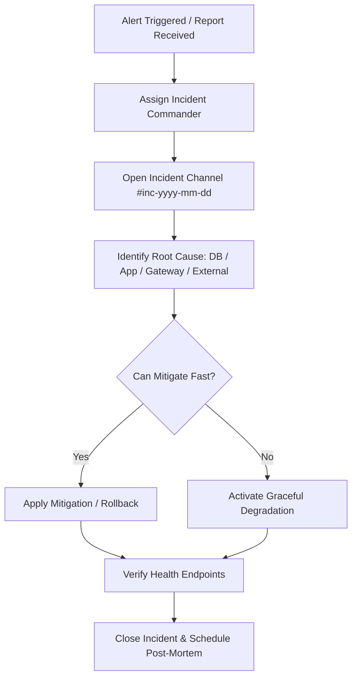

# 🚨 Runbook 01: Incident Response Procedure

> **Target Severity**: P1 (Outage / Core Feature Down) & P2 (Degraded Performance)

---

## Severity Definitions

| Level | Impact | Example | Escalation SLA |
|-------|--------|---------|----------------|
| **P1 - CRITICAL** | Platform down, payments failing, ride matching completely blocked | Database outage, API Gateway 5xx > 10% | **15 Minutes** |
| **P2 - HIGH** | Major feature impaired for subset of users | Push notification delay, Redis geo latency high | **30 Minutes** |
| **P3 - MEDIUM** | Non-critical feature broken | Admin analytics charts slow, email receipt delay | **4 Hours** |

---

## P1 Incident Response Step-by-Step

### Step 1: Triage & Identification
1. Check Grafana / Sentry / CloudWatch dashboards.
2. Determine impacted layer:
   - **PostgreSQL**: Check connection count (`pg_stat_activity`) and CPU.
   - **Redis**: Check memory usage (`INFO memory`) and latency.
   - **Backend Instances**: Check JVM heap, thread count, HTTP status error rates.
   - **Payment Gateway**: Check Razorpay status page.

### Step 2: Immediate Mitigation Controls
- **If DB Connection Exhaustion**: Restart backend pods with connection pool caps or scale read replicas.
- **If Redis Crash**: Flush non-critical cache keys: `REDIS-CLI FLUSHDB` (Heartbeats & Driver Geo will automatically rebuild within 30s as drivers update).
- **If Bad Deployment**: Execute instant rollback via CI/CD deployment pipeline to previous stable version tag.

### Step 3: Post-Incident Action Items
- Write Post-Mortem within 48 hours focusing on root cause analysis, timeline, action items, and prevention mechanisms.
